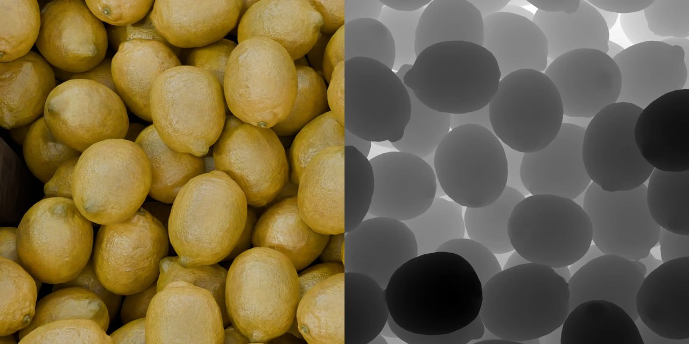
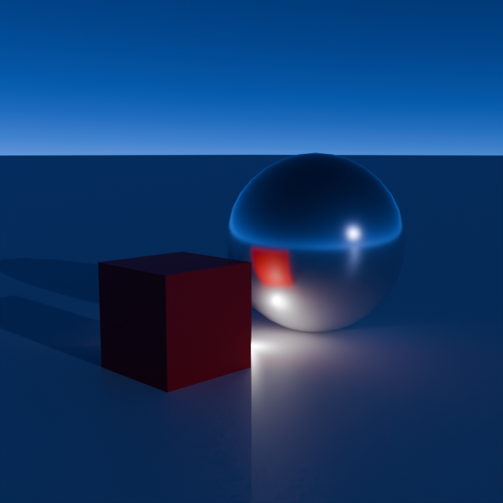

# `rv`

- [Company website](https://rapid-vision.ru)
- [Tutorial](https://rapid-vision.github.io/rv/en/tutorial)
- [Features overview](https://rapid-vision.github.io/rv/en/tutorial/features)
- [API Reference](https://rapid-vision.github.io/rv/en/api)

**`rv`** is a lightweight toolset for generating labeled synthetic image datasets with just a few lines of code.



## Advantages
1. Photorealistic results using [Cycles](https://www.blender.org/features/rendering/#cycles) rendering engine
2. Simple and clean Python API
3. Automatic segmentation labeling creation
3. Completely open source
4. Seamless integration with [Blender's](https://www.blender.org/) rich procedural toolset.


## Getting started

### Install dependencies
Install [Go](https://go.dev/doc/install) and [Blender](https://www.blender.org/download/).

### Install the `rv` tool
```bash copy
go install github.com/Rapid-Vision/rv@latest
```

### Create scene script
```python
import rv

class BasicScene(rv.Scene):
    def generate(self, seed):
        world = rv.SkyWorld()
        world.set_params(strength=0.1, sun_intensity=0.03)
        self.set_world(world)

        mat_cube = self.create_material().set_params(base_color=[1, 0, 0])
        cube = (
            self.create_cube()
            .set_location((1, 0, 0.5))
            .set_scale(0.5)
            .set_tags("cube")
            .set_material(mat_cube)
        )
        mat_sphere = self.create_material().set_params(metallic=1, roughness=0.2)
        sphere = (
            self.create_sphere()
            .set_location((-1, 0, 1))
            .set_shading("smooth")
            .set_tags("sphere")
            .set_material(mat_sphere)
        )
        plane = self.create_plane(size=1000)
        empty = self.create_empty().set_location((0, 0, 1))

        light = self.create_point_light(power=10).set_location([0, 0, 0.1])

        cam = self.get_camera().set_location((5, 5, 2)).point_at(empty)
```

### Preview the scene
```bash copy
rv preview scene.py
```
Don't close the preview window yet.

Alternatively you can export one live-updating preview sample as files:
```bash copy
rv preview scene.py --preview-files --preview-out ./preview_out
```

To run file-only live preview without opening Blender UI:
```bash copy
rv preview scene.py --preview-files --no-window --preview-out ./preview_out
```

### Randomize the scene
See how the preview changes on each file save.
```python
import random
import rv

class BasicScene(rv.Scene):
    def generate(self, seed):
        rng = random.Random(seed)
        world = rv.SkyWorld()
        world.set_params(strength=0.1, sun_intensity=0.03)
        self.set_world(world)

        mat_cube = self.create_material().set_params(base_color=[1, 0, 0])
        cube = (
            self.create_cube()
            .set_location((1, 0, 0.5))
            .set_scale(0.5)
            .set_tags("cube")
            .set_material(mat_cube)
        )
        cube.rotate_around_axis(rv.mathutils.Vector((0, 0, 1)), rng.uniform(0, 360))
        mat_sphere = self.create_material().set_params(metallic=1, roughness=0.2)
        sphere = (
            self.create_sphere()
            .set_location((-1, 0, 1))
            .set_shading("smooth")
            .set_tags("sphere")
            .set_material(mat_sphere)
        )
        plane = self.create_plane(size=1000)
        empty = self.create_empty().set_location((0, 0, 1))

        light = self.create_point_light(power=10).set_location([0, 0, 0.1])

        cam = self.get_camera().set_location((5, 5, 2)).point_at(empty)
```
### Render the final result
```bash copy
rv render scene.py
```

Control reproducibility with `--seed`:

```bash copy
rv render scene.py --seed rand
rv render scene.py --seed seq
rv render scene.py --seed 42
```




## Use `rv` for generating your next synthetic dataset
For more information view [Features overview](https://rapid-vision.github.io/rv/en/tutorial/features) and [API Reference](https://rapid-vision.github.io/rv/en/api).

## Testing

Run Go tests:

```bash
go test ./...
```

Run Python unit tests that do not require Blender:

```bash
make test-python-unit
```

Run Blender integration tests:

```bash
make test-blender
```

The Blender test command resolves Blender the same way as `rv` runtime:
`BLENDER_PATH`, then `blender` from `PATH`, then OS fallback locations.
