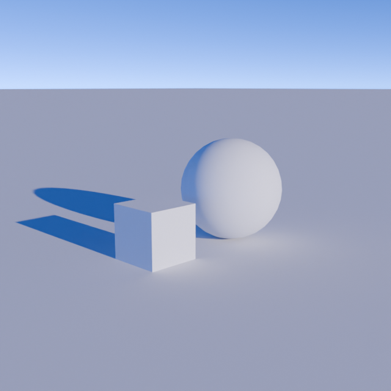
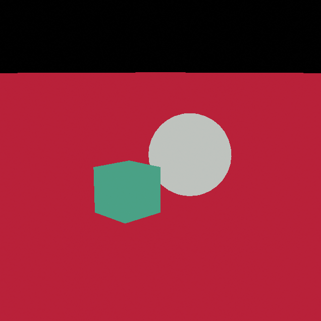

# Rapid Vision

- [Website](https://rapid-vision.github.io)
- [Tutorial](https://rapid-vision.github.io/docs/tutorial)
- [API Reference](https://rapid-vision.github.io/docs/api)

**Rapid Vision (`rv`)** is a lightweight toolset for generating labeled synthetic image datasets with just a few lines of code.

## Advantages
1. Photorealistic results using [Cycles](https://www.blender.org/features/rendering/#cycles) rendering engine
2. Simple and clean Python API
3. Automatic segmentation labeling creation
3. Completely open source
4. Seamless integration with [Blender's](https://www.blender.org/) rich procedural toolset.


## Getting started

### Install dependencies
Install [Go](https://go.dev/doc/install) and [Blender](https://www.blender.org/download/).

### Install the `rv` tool
```bash copy
go install github.com/Rapid-Vision/rv@latest
```

### Create scene script
```python copy setLineNumebers filename="scene.py"
import rv

class BasicScene(rv.Scene):
    def generate(self):
        self.get_world().set_params(sun_intensity=0.03)
        cube = (
            self.create_cube().set_location((1, 0, 0.5)).set_scale(0.5).set_tags("cube")
        )
        sphere = (
            self.create_sphere()
            .set_location((-1, 0, 1))
            .set_shading("smooth")
            .set_tags("sphere")
        )
        plane = self.create_plane(size=1000)
        empty = self.create_empty().set_location((0, 0, 1))

        cam = self.get_camera().set_location((7, 7, 3)).point_at(empty)
```

### Preview the scene
```bash copy
rv preview scene.py
```
Don't close the preview window yet.

### Randomize the scene
See how the preview changes on each file save.
```python copy setLineNumebers filename="scene.py" {2, 10}
import rv
from random import uniform

class BasicScene(rv.Scene):
    def generate(self):
        self.get_world().set_params(sun_intensity=0.03)
        cube = (
            self.create_cube().set_location((1, 0, 0.5)).set_scale(0.5).set_tags("cube")
        )
        cube.rotate_around_axis(rv.mathutils.Vector((0, 0, 1)), uniform(0, 360))
        sphere = (
            self.create_sphere()
            .set_location((-1, 0, 1))
            .set_shading("smooth")
            .set_tags("sphere")
        )
        plane = self.create_plane(size=1000)
        empty = self.create_empty().set_location((0, 0, 1))

        cam = self.get_camera().set_location((7, 7, 3)).point_at(empty)
```
### Render the final result
```bash copy
rv render scene.py
```




## Use `rv` for generating your next synthetic dataset
For more information view the [API reference](/docs/api).

